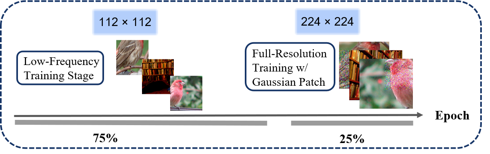

# FastDINOv2: Frequency Based Curriculum Learning Improves Robustness and Training Speed
# Abstract:
Large-scale vision foundation models such as DINOv2 boast impressive performances by leveraging massive architectures and training datasets. But numerous scenarios require practitioners to reproduce those pre-training solutions, such as on private data, new modalities, or simply for scientific questioning--which is currently extremely demanding computation-wise. We thus propose a novel pre-training strategy for DINOv2 that simultaneously accelerates convergence--and strengthens robustness to common corruptions as a by-product. Our approach involves a frequency filtering curriculum--low-frequency being seen first--and the Gaussian noise patching augmentation. Applied to a ViT-B/16 backbone trained on ImageNet-1K, while pre-training time and FLOPs are is reduced by 1.6x and 2.25x, our method still achieves matching robustness in corruption benchmarks (ImageNet-C) and maintains competitive linear probing performance compared with baseline. This dual benefit of efficiency and robustness makes large-scale self-supervised foundation modeling more attainable, while opening the door to novel exploration around data curriculum and augmentation as a means to improve self-supervised learning models robustness. 

<figure>

<!-- 
 -->
</figure>

## Environmental setup
Please follow [DINOv2](https://github.com/facebookresearch/dinov2) for all required packages and environments.

### Dataset Preparation
1. Download [Imagenet-100](https://drive.google.com/file/d/1BpNAjPypv5l9U0Wu9x3_IgN09_vf9A9O/view?usp=sharing), which includes 50000 training and 5000 validation images.

2. Download the Imagenet-1k dataset with the following directory structure:
```shell
imagenet/
├── train/
│   ├── n01440764/
│   ├── n01443537/
│   └── ...
└── val/
    ├── n01440764/
    ├── n01443537/
    └── ...
```
3. Download the mini-imagenet-C from [here](https://drive.google.com/file/d/1V2SxC_eF6C5eai1is4aM33C4erJUg6Gi/view?usp=sharing).
4. Metadata generation: in ``` process_metadata.py```, replace ```root``` with the path to the mini-imagenet and imagenet. Run ```python process_metadata.py```.
5. For the Oxford and Paris instance recognition experiment, download from this [repo](https://github.com/filipradenovic/revisitop).


### Imagnet-100 and Imagenet-1K Experiments:
1. Modify the path for mini-imagenet, mini-imagenet-extra and imagenet, imagenet-extra in train_imagenet_100.sh, train_imagenet_1k.sh.
2. Train DINOv2 with ```sh train_imagenet_100.sh```, ```sh train_imagenet_1k.sh```.
3. Change the path of output folder to the one from step 2, and run linear probing on the model checkpoint with ```sh linear_probe_submit_100.sh```, ```sh linear_probe_submit_1k.sh```.
4. Evaluate on mini-imagenet-C and imagenet-C. Make sure the folder structures are as follows:
```
shell
imagenet-c/
├── corruption_type/
    ├── Corruption_level/
         ├── labels.txt
         ├── val/
              ├── n01532829/
              └── ...
```
Change the output folder path in ```linear_probe_submit_1K.sh``` and ```linear_probe_submit_100.sh```. With the trained linear classifier in step 3, run ```sh linear_probe_submit_1K.sh``` and ```linear_probe_submit_100.sh```.
